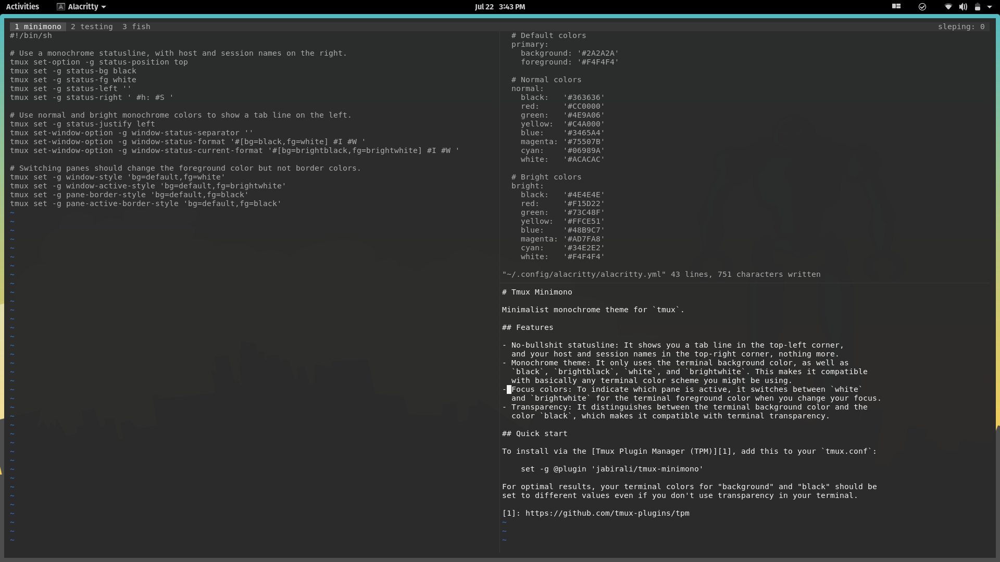

# Tmux Minimono

Minimalist monochrome theme for `tmux`.

## Features

- No-bullshit statusline: It shows you a tab line in the top-left corner,
  and your host and session names in the top-right corner, nothing more.
- Monochrome theme: It only uses the terminal background color, as well as
  `black`, `brightblack`, `white`, and `brightwhite`. This makes it compatible
  with basically any terminal color scheme you might be using.
- Focus colors: To indicate which pane is active, it switches between `white`
  and `brightwhite` for the terminal foreground color when you change your focus.  
- Transparency: It distinguishes between the terminal background color and the
  color `black`, which makes it compatible with terminal transparency.

## Quick start

To install via the [Tmux Plugin Manager (TPM)][1], add this to your `tmux.conf`:

    set -g @plugin 'jabirali/tmux-minimono'

For optimal results, your terminal colors for "background" and "black" should be
set to different values even if you don't use transparency in your terminal.

[1]: https://github.com/tmux-plugins/tpm
